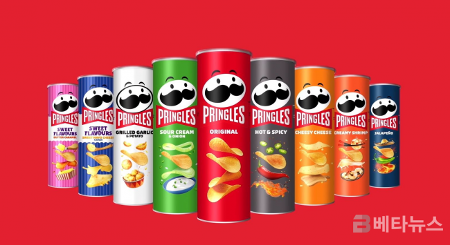

# stack

- 쌓아 올린다는 것을 의미
- 메모리 안 데이터들을 효율적이게 다루기 위해 만들어진 데이터 참조 방식
- LIFO(Last In First Out) 후입선출

## 특징

- 프링글스 통이라고 생각하면 쉽다!

  - 맨 위에 과자부터 차례대로 먹는다!
    

- 같은 구조와 크기의 자료를 정해진 방향으로만 쌓을 수 있다.
- top으로 정한 곳을 통해서만 접근 할 수 있다.
- 스택에서 삽입하는 연산을 'push', 삭제하는 연산은 'pop' 이라고 한다.
- 가장 마지막에 삽입된 자료가 가장 먼저 삭제된다.

## 주요 동작

- push : 삽입
- pop : 삭제
- peek : 조회(최상단)

## 활용 예시

- 웹 브라우저 방문기록, 뒤로가기
- 실행 취소 ( ctrl + z)

## 구현

1. 정적 1차원 배열

2. 동적 연결 리스트

스택이 무엇인지에 대한 조사
js 유틸 함수들을 사용하지 않고 스택 구현(배열의 push, shift 쓰지않고)
지금까지 개발해오면서 이것이 스택이었구나 하는 실제 사용사례 조사하기
