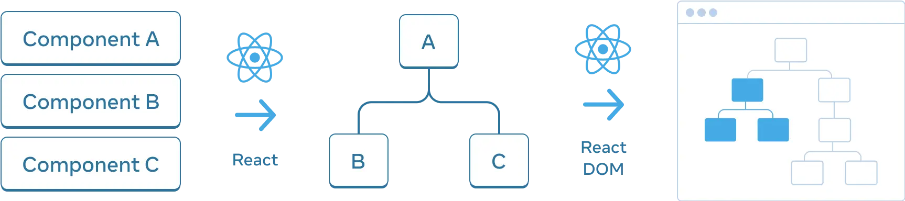
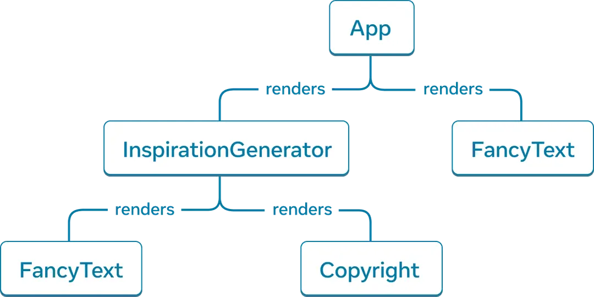
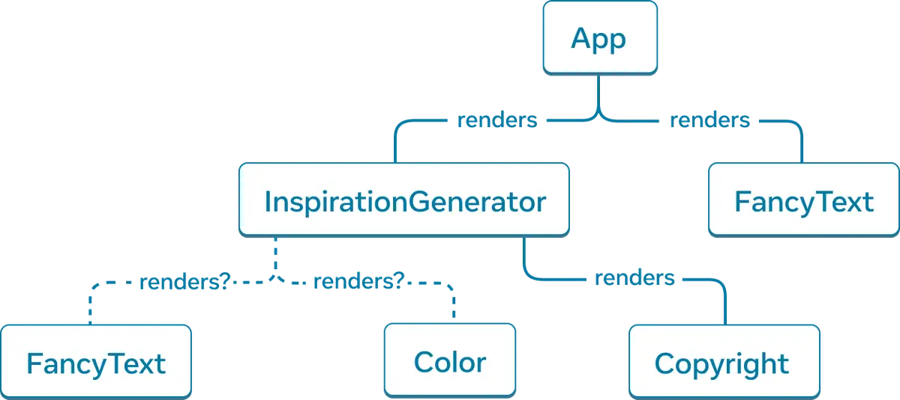
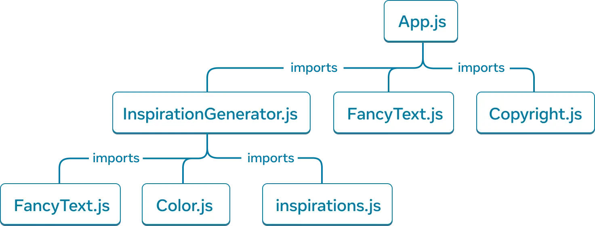

# 8. 컴포넌트 순수하게 유지하기

> ### 학습내용
>
> - 순수성이란 무엇인지, 어떻게 버그를 피하도록 도와주는지
> - 렌더 단계에서 변화를 유지하면서 컴포넌트를 순수하게 유지
> - 엄격 모드를 어떻게 활용해서 컴포넌트에 실수를 발견할 수 있는지

## 순수성

1. 자신의 일에 집중, 함수가 호출되기 전에 존재했던 어떤 객체나 변수는 변경하지 않는다.
2. 같은 입력, 같은 출력이 주어졌다면 같은 결과를 반환해야 한다.
   > y = 2x 라는 공식이 있다고 가정
   >
   > x = 2라면 y = 4가 되어야 한다.
   ```js
   function double(x) {
     return 2 * x;
   }
   ```

## 사이드 이펙트(부작용)

```jsx
let guest = 0;

function Cup() {
  // 나쁜 지점: 이미 존재했던 변수를 변경하고 있다!
  guest = guest + 1;
  return <h2>Tea cup for guest #{guest}</h2>;
}

export default function TeaSet() {
  return (
    <>
      <Cup />
      <Cup />
      <Cup />
    </>
  );
}
```

- 위의 코드처럼 함수 내부에서 외부 변수를 변경하는 것을 사이드 이펙트라고 한다.
- 다른 컴포넌트 가 guest를 읽었다면 언제 렌더링 되었는지에 따라 그 컴포넌트 또한 다른 JSX를 생성

#### guest 변수를 대신 프로퍼티로 넘겨 이 컴포넌트를 고칠 수 있다.

```jsx
function Cup({ guest }) {
  return <h2>Tea cup for guest #{guest}</h2>;
}
export default function TeaSet() {
  return (
    <>
      <Cup guest={1} />
      <Cup guest={2} />
      <Cup guest={3} />
    </>
  );
}
```

- 렌더링은 학교 숙제와 같다. 각 컴포넌트는 자체적으로 JSX를 연산해야 한다!

## 엄격 모드(StrictMode)

- 컴포넌트에 실수를 발견할 수 있도록 도와주는 도구

- props, state, context는 항상 읽기전용으로 취급해야 한다.
- 사용자의 입력에 따라 무언가를 변경하려는 경우, 변수를 직접 수정하는 대신 set state를 사용해야 한다.
- 컴포넌트가 렌더링 되는 동안 기존 변수나 개체를 변경하면 버그가 발생할 수 있다.

> React는 개발중에 각 컴포넌트의 함수를 두번 호출하는 **엄격 모드** 를 제공한다.
>
> 컴포넌트 함수를 두번 호출함으로써, 규칙을 위반하는 컴포넌트를 찾는데 도움을 준다.
>
> 엄격 모드는 개발 중에만 활성화되므로 프로덕션 빌드에는 영향을 미치지 않는다.

### 엄격모드를 사용하기 위해서는 최상단 컴포넌트를 래핑해야 한다.

## 지역 변형

```jsx
function Cup({ guest }) {
  return <h2>Tea cup for guest #{guest}</h2>;
}

export default function TeaGathering() {
  let cups = [];
  for (let i = 1; i <= 12; i++) {
    cups.push(<Cup key={i} guest={i} />);
  }
  return cups;
}
```

- cups의 변수나 배열이 TeaGathering의 바깥에 있었다면 문제가 생길 수 있었다.(메모리 누수)

## 부작용을 일으킬 수 있는 지점

- 화면을 업데이트하고 애니메이션을 시작하고 데이터를 변경하는 것을 사이드 이펙트라고 한다.
- 렌더링 중에 발생한 것이 아니라 **'사이드'** 에서 발생하는 현상

#### React에선 사이드 이펙트는 보통 이벤트 핸들러 에 포함된다.

- 예를 들어 클릭
- 이벤트 핸들러가 컴포넌트 내부에 정의되었더라도 렌더링 중에는 실행되지 않는다.

  > 그래서 이벤트 핸들러는 순수할 필요가 없다.

- 사이드 이펙트에 적합한 이벤트 핸들러를 찾을 수 없는 경우에도, 컴포넌트에서 useEffect를 사용해 사이드 이펙트를 처리할 수 있다.(마지막 수단)

## React가 순수함에 신경쓰는 이유

- 컴포넌트는 다른 환경에서도 실행될 수 있다.
  - 서버에서 실행될 수 있다.
  - 동일한 입력에 대해 동일한 결과를 반환하기 때문에 하나의 컴포넌트는 많은 사용자 요청을 처리할 수 있다.
- 입력이 변경되지 않는 컴포넌트 렌더링을 건너뛰어 성능을 향상시킬 수 있다.
  - 순수 함수는 항상 동일한 결과를 반환하므로 캐시하기에 안전하다.
- 깊은 컴포넌트 트리를 렌더링 하는 도중에 일부 데이터가 변경되는 경우 React는 변경된 부분만 다시 렌더링 한다.
  - 순수함은 언제든지 연산을 중단하는 것을 안전하게 한다.

> 우리가 구축하고 있는 모든 새로운 React 기능은 순수성을 활용한다.

## 요약

1. 컴포넌트는 순수해야만 한다.
2. 렌더링은 언제든지 발생할 수 있으므로 컴포넌트는 서로의 렌더링 순서에 의존하지 않아야한다.
3. 컴포넌트가 렌더링을 위해 사용되는 입력을 변형하지 않아야 한다.
4. 반환하는 JSX는 순수 함수의 반환값이어야 한다.

## 챌린지

### 1. 고장난 시계 고치기

```jsx
export default function Clock({ time }) {
  let hours = time.getHours();
  if (hours >= 0 && hours <= 6) {
    document.getElementById("time").className = "night";
  } else {
    document.getElementById("time").className = "day";
  }
  return <h1 id="time">{time.toLocaleTimeString()}</h1>;
}
```

- DOM(HTML요소)를 직접 수정함.
- 렌더링 시점에 id가 title인 요소를 찾지 못함.

```jsx
export default function Clock({ time }) {
  let hours = time.getHours();
  let className = hours >= 0 && hours <= 6 ? "night" : "day";
  return (
    <h1 id="time" className={className}>
      {time.toLocaleTimeString()}
    </h1>
  );
}
```

### 2. 망가진 프로필 고치기

```jsx
//App.js
import Profile from "./Profile.js";

export default function App() {
  return (
    <>
      <Profile
        person={{
          imageId: "lrWQx8l",
          name: "Subrahmanyan Chandrasekhar"
        }}
      />
      <Profile
        person={{
          imageId: "MK3eW3A",
          name: "Creola Katherine Johnson"
        }}
      />
    </>
  );
}

//Profile.js
import Panel from './Panel.js';
import { getImageUrl } from './utils.js';

let currentPerson;

export default function Profile({ person }) {
  currentPerson = person;
  return (
    <Panel>
      <Header />
      <Avatar />
    </Panel>
  )
}

function Header() {
  return <h1>{currentPerson.name}</h1>;
}

function Avatar() {
  return (
    
  );
}

```

- currentPerson이 전역변수로 선언
- currentPerson으로 전달하는 데이터가 의도한 데이터가 아님

```jsx
import Panel from "./Panel.js";
import { getImageUrl } from "./utils.js";

export default function Profile({ person }) {
  return (
    <Panel>
      <Header person={person} />
      <Avatar person={person} />
    </Panel>
  );
}

function Header({ person }) {
  return <h1>{person.name}</h1>;
}

function Avatar({ person }) {
  return (
    
  );
}
```

### 3. 깨진 스토리 트레이

```jsx
export default function StoryTray({ stories }) {
  stories.push({
    id: "create",
    label: "Create Story"
  });

  return (
    <ul>
      {stories.map(story => (
        <li key={story.id}>{story.label}</li>
      ))}
    </ul>
  );
}
```

- 배열을 직접 수정함. -> 불변성의 원칙을 지키지 않음
- StoryTray가 여러번 렌더링 되면, stories.push가 여러번 호출이 되어 중복되는 데이터가 추가될 수 있음.

```jsx
export default function StoryTray({ stories }) {
  let updatedStories = [...stories, { id: "create", label: "Create Story" }];

  return (
    <ul>
      {updatedStories.map(story => (
        <li key={story.id}>{story.label}</li>
      ))}
    </ul>
  );
}
```

# 9. 트리로서의 UI

> ### 학습내용
>
> - React가 컴포넌트 구조를 이해하는 방법
> - 렌더 트리란 무엇이고 어떤 용도로 사용되는지
> - 모듈 의존성 트리가 무엇이고 어떤 용도로 사용되는지

## 트리로서의 UI

- 트리는 요소와 UI 사이의 관계 모델이다.



- React도 React 앱의 컴포넌트 간의 관계를 관리하고 모델링하기 위해 트리 구조를 사용
- 트리는 React 앱에서 데이터가 흐르는 방식과 렌더링 및 앱 크기를 최적화하는 방법을 이해하는 데 유용한 도구

## 렌더 트리

- 컴포넌트를 중첩하면 부모, 자식 개념이 생기며 각 부모 컴포넌트는 다른 컴포넌트의 자식이 될 수 있다.



- 트리는 노드로 구성
- 각 노드는 컴포넌트를 나타냄
- React 렌더 트리에서는 루트 노드는 앱의 Root 컴포넌트이다.
  - 위의 사진에서는 App이 루트 노드이다.

### 렌더 트리에 HTML 태그는 어디에?

- 위의 렌더 트리에서 각 컴포넌트가 렌더링하는 HTML 태그에 대한 언급이 없음을 알 수 있다.
- 이는 렌더 트리가 React 컴포넌트로만 구성되어 있기 때문이다.

### 조건부 렌더링을 사용하면?



- inspiration.type이 무엇이냐에 따라 `<FancyText>`, `<Color>`를 렌더링
- 렌더 트리는 렌더링마다 다를 수 있음.
- 리프 컴포넌트는 트리의 맨 아래에 있으며 자식 컴포넌트가 없으며 자주 다시 렌더링

## 모듈 의존성 트리

- 트리로 모델링 할 수 있는 React앱의 다른 관계는 **앱의 모듈 의존성**
- 컴포넌트를 분리하고 로직을 별도의 파일로 분리하면 컴포넌트, 함수 또는 상수를 내보내는 JS 모듈을 만들 수 있다.



- 트리의 루트 노드는 **루트 모듈**이며, **엔트리 포인트 파일이라**고도 한다.
- 일반적으로 루트 컴포넌트를 포함하는 모듈

> #### 동일한 앱의 렌더 트리와 비교하면 유사한 구조가 있지만 몇 가지 차이점이 있다
>
> - 트리를 구성하는 노드는 컴포넌트가 아닌 모듈을 나타낸다
> - inspirations.js와 같은 컴포넌트가 아닌 모듈도 이 트리에 나타남
> - 렌더 트리는 컴포넌트만 캡슐화 한 것임

- 의존성 트리는 React앱을 실행하는데 필요한 모듈을 결정하는데 유용
- 앱을 프로덕션용으로 빌드할 때, 일반적으로 클라이언트에 제공할 모든 필요 JavaScript를 번들로 묶는 빌드 단계가 있음.
- 이를 번들러라고 함
- 번들러는 의존성 트리를 사용하여 포함해야 할 모듈을 결정한다

## 요약

- 트리는 요소 간의 관계를 나타내는 일반적인 방법

#### 렌더트리

- 렌더 트리는 단일 렌더링에서 React 컴포넌트 간의 중첩 관계를 나타냄
- 조건부 렌더링을 사용하면 렌더트리가 다른 렌더링에서 변경될 수 있음.
- 렌더 트리는 최상위 컴포넌트와 리프 컴포넌트를 식별하는데 도움이 된다.
  - 최상위 컴포넌트는 그 아래의 모든 컴포넌트의 렌더링 성능에 영향을 미침
  - 리프 컴포넌트는 자주 렌더링이 된다.

#### 의존성 트리

- 의존성 트리는 앱의 모듈 의존성을 나타낸다.
- 앱을 배포하기 위해 필요한 코드를 번들로 묶는 데 빌드 도구에서 사용
- 어떤 코드를 번들로 묶을지 최적화할 기회를 제공한다.

> #### Vue와 공통점
>
> - 가상 DOM을 사용하여 실제 DOM 조작을 최소화
> - 가상 DOM은 UI 상태 변화를 관리하고 필요한 부분만 업데이트해서 빠른 렌더링을 지원
